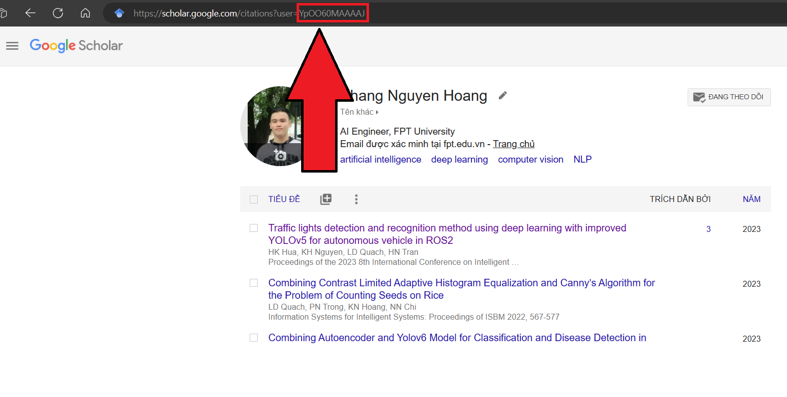

# Update Scholar README Action


[](LICENSE)

A GitHub Action to effortlessly update your README with your latest Google Scholar activity.

## Usage
- Add the comment `<!-- SCHOLAR-LIST:START --><!-- SCHOLAR-LIST:END -->` (entry point) within README.md. [example](https://github.com/khengyun/khengyun#-top-5-publications)
- It's the time to create a workflow file.
`.github/workflows/update-readme.yml`

```yaml
name: Update Scholar Activity

on:
  schedule:
    - cron: '0 0 * * *' # Run every day at midnight
  workflow_dispatch:


jobs:
  update_scholar_readme:
    runs-on: ubuntu-latest
    name: Update Scholar README
    permissions: 
      contents: write
    steps:
      - name: Checkout repository
        uses: actions/checkout@v4
      - name: update readme
        id: update_readme
        uses: khengyun/readme-scholar-activity@main
        with:
          SCHOLAR_ID: 'YpOO60MAAAAJ' # change to your SCHOLAR ID 
          LIMIT: 5 # limit the number of research 
      - uses: EndBug/add-and-commit@v9
        with:
          default_author: github_actions
```
## Inputs


- `SCHOLAR_ID` (required): Your Google Scholar user ID.



## Example Workflow:

This example workflow is scheduled to run every day at midnight and will also trigger on manual actions or pushes to the main branch to update the README with the latest Google Scholar activity.
## Author:

*khengyun*

